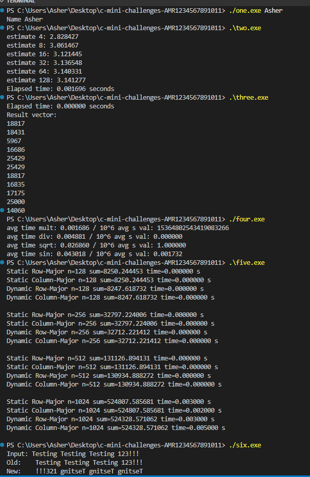

## One
just stdio
## Two
refrenced equation for side length and doubling
## Three
Just used n^2 approach ran good enough
## Four
Had some difficulty making compiler not optimize away the operations, but matches expectations
## Five
As the size grows the column major approach has more and more cache misses and slows down, but there was little real difference in static vs dynamic speed
## Six
Ugly but finds the end and flips characters, used the function pointer
## output
